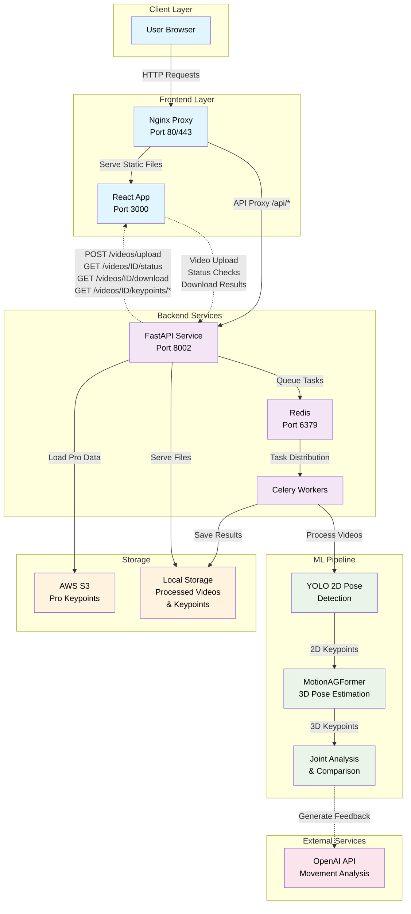

# Shadow Trainer - AI-Powered Motion Analysis

Video processing platform for athletic motion analysis using YOLO pose estimation and AI feedback. Compare your movement to professional athletes with 3D visualization.

## Quick Start

### Prerequisites
- Linux EC2 instance 
- Python 3.9+ with [uv](https://github.com/astral-sh/uv)
- Node.js 18+ and npm
- OpenAI API key (optional, for AI feedback)

### Setup
```bash
# Clone and install
git clone https://github.com/henrym105/shadow-trainer.git
cd shadow-trainer
./scripts/install_setup_uv.sh
cd api_frontend && npm install

# Configure OpenAI (optional)
echo "OPENAI_API_KEY=your_key_here" > .env

# Start services
make dev        # Development
make prod       # Production
```

### Commands
- `make dev` / `make prod` — Start services
- `make stop` — Stop all services  
- `make health` — Health check
- `make dev-logs` / `make prod-logs` — View logs

## Features

### Core Functionality
- **Video Upload** — Drag & drop with validation
- **Motion Analysis** — YOLO 2D + MotionAGFormer 3D pose estimation
- **Professional Comparison** — Compare against pro athlete movements
- **Real-time Processing** — Background jobs with progress updates

### 3D Visualization
- Interactive skeleton viewer at `/visualize/{task_id}`
- Playback controls (play/pause, speed, frame scrubbing)
- Toggle user/pro skeletons independently
- Turntable rotation for different viewing angles

### AI Feedback
- Generate detailed movement analysis using OpenAI
- Joint-by-joint biomechanical evaluation
- Coaching insights and improvement suggestions

## API Endpoints

### Core
- `POST /api/videos/upload` — Upload and process video
- `GET /api/videos/{id}/status` — Processing status
- `GET /api/videos/{id}/download` — Download result
- `GET /api/videos/{id}/preview` — Stream preview

### Visualization
- `GET /api/videos/{id}/keypoints/user` — User 3D keypoints
- `GET /api/videos/{id}/keypoints/pro` — Pro athlete keypoints
- `POST /api/videos/{id}/generate-evaluation` — Generate AI feedback

## Architecture

**Stack:** React frontend + FastAPI backend + Nginx proxy + Redis/Celery
**Deployment:** Docker Compose on EC2




## Development

### Project Structure
```
shadow-trainer/
├── api_backend/           # FastAPI + ML pipeline
├── api_frontend/          # React app
└── Makefile               # Commands
```

### Adding Features
- **Backend:** Modify `api_service.py`, `tasks.py`
- **Frontend:** Update components in `src/components/`
- **Infrastructure:** Update Makefile/nginx configs