# Shadow Trainer - AI-Powered Motion Analysis

<div align="center">
    <br>
    <a href="https://www.shadow-trainer.com">www.shadow-trainer.com</a>
    <p></p>
    <a href="https://youtu.be/VFyjWKRGb20">Watch a Demo Video of the Web app on (Youtube)</a>
    <p></p>
</div>

**Shadow Trainer** is an athletic motion analysis platform that uses advanced computer vision and AI to analyze baseball pitching mechanics. 

We envision a world where everyone can train like a pro, and our mission is to democratize access to high-quality motion analysis tools.

Upload a video of your pitch - or record one right in the app - to get detailed biomechanical analysis comparing your motion to that of your favorite MLB pitcher.

## 🚀 Quick Start

### Prerequisites
- **Linux/macOS** with Docker installed
- **Python 3.9+** with [uv](https://github.com/astral-sh/uv) package manager
- **Node.js 18+** and npm
- **OpenAI API key** (optional, for AI coaching feedback)

### Installation
```bash
# Clone repository
git clone https://github.com/henrym105/shadow-trainer.git
cd shadow-trainer

# Install Python dependencies
./scripts/install_setup_uv.sh

# Install frontend dependencies
cd api_frontend && npm install && cd ..

# Configure environment (optional)
echo "OPENAI_API_KEY=your_key_here" > .env.prod

# Start the application
make prod-build
```

### Commands
```bash
make dev          # Development mode
make prod         # Production mode  
make stop         # Stop all services
make health       # System health check
```

## 🎯 Platform Features

- **Video Upload** - Drag & drop interface with format validation
- **2D/3D Pose Detection** - Advanced computer vision analysis
- **Motion Comparison** - Compare your technique to MLB professionals
- **Biomechanical Analysis** - Joint angles, velocities, and timing metrics
- **AI Coaching** - Personalized feedback powered by OpenAI
- **3D Visualization** - Interactive skeleton viewer with playback controls
## 🏗️ System Architecture

```mermaid
graph TB
    %% User Interface Layer
    User[👤 User] --> React[React Frontend<br/>Port 3000]
    
    %% Load Balancer & Reverse Proxy
    React --> Nginx[Nginx Reverse Proxy<br/>Port 80/443]
    
    %% API Gateway
    Nginx --> FastAPI[FastAPI Backend<br/>Port 8002]
    
    %% Task Queue System
    FastAPI --> Redis[(Redis Broker<br/>Port 6379)]
    Redis --> CeleryWorker1[Celery Worker 1]
    Redis --> CeleryWorker2[Celery Worker 2] 
    Redis --> CeleryWorker3[Celery Worker 3]
    
    %% Monitoring
    Redis --> Flower[Flower Monitor<br/>Port 5555]
    
    %% ML Processing Pipeline
    CeleryWorker1 --> YOLO[YOLO11x-pose<br/>2D Pose Detection]
    YOLO --> MotionAG[MotionAGFormer<br/>3D Pose Estimation]
    MotionAG --> Analysis[Biomechanical Analysis<br/>Joint Angles & Velocities]
    Analysis --> Visualization[3D Visualization<br/>Charts & Plots]
    
    %% External Services
    FastAPI --> OpenAI[OpenAI API<br/>AI Coaching Feedback]
    FastAPI --> S3[AWS S3<br/>Pro Athlete Data]
    
    %% Storage
    FastAPI --> FileSystem[Local File System<br/>Videos & Results]
    
    %% Container Orchestration
    subgraph EC2[EC2 Instance - Docker Compose]
        direction TB
        Nginx
        React
        FastAPI
        Redis
        CeleryWorker1
        CeleryWorker2
        CeleryWorker3
        Flower
        FileSystem
    end
    
    %% Technology Stack Labels
    classDef frontend fill:#61dafb,stroke:#333,color:#000
    classDef backend fill:#ff6b6b,stroke:#333,color:#fff
    classDef ml fill:#4ecdc4,stroke:#333,color:#fff
    classDef storage fill:#95e1d3,stroke:#333,color:#000
    classDef external fill:#ffd93d,stroke:#333,color:#000
    
    class React,Nginx frontend
    class FastAPI,Redis,CeleryWorker1,CeleryWorker2,CeleryWorker3,Flower backend
    class YOLO,MotionAG,Analysis,Visualization ml
    class FileSystem,S3 storage
    class OpenAI,User external
```



## 📁 Project Structure

```
shadow-trainer/
├── api_backend/           # Python FastAPI backend
├── api_frontend/          # React frontend  
├── docker-compose.yml     # Production services
└── Makefile              # Build commands
```

For detailed technical documentation:
- [Backend Documentation](api_backend/README.md) - API endpoints, ML pipeline, development setup
- [Frontend Documentation](api_frontend/README.md) - Components, 3D visualization, styling

## 🔧 Development

Access the application at:
- **Frontend**: http://localhost:3000
- **API Docs**: http://localhost:8002/docs
- **Task Monitor**: http://localhost:5555

Environment variables (optional):
```bash
OPENAI_API_KEY=sk-...        # For AI coaching feedback
AWS_ACCESS_KEY_ID=...        # For pro athlete data
AWS_SECRET_ACCESS_KEY=...
S3_BUCKET=shadow-trainer-prod
```
